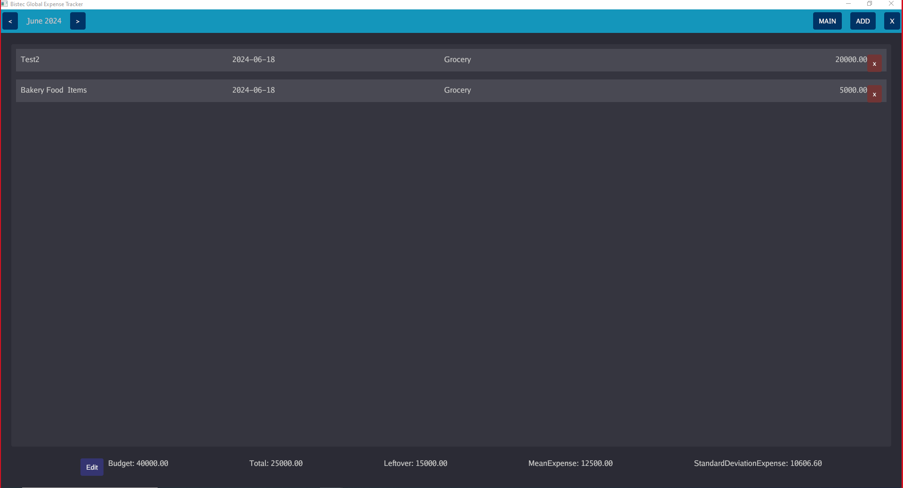
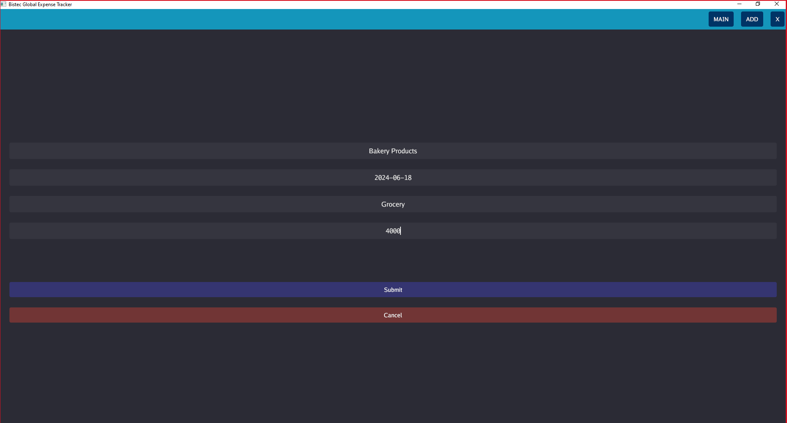
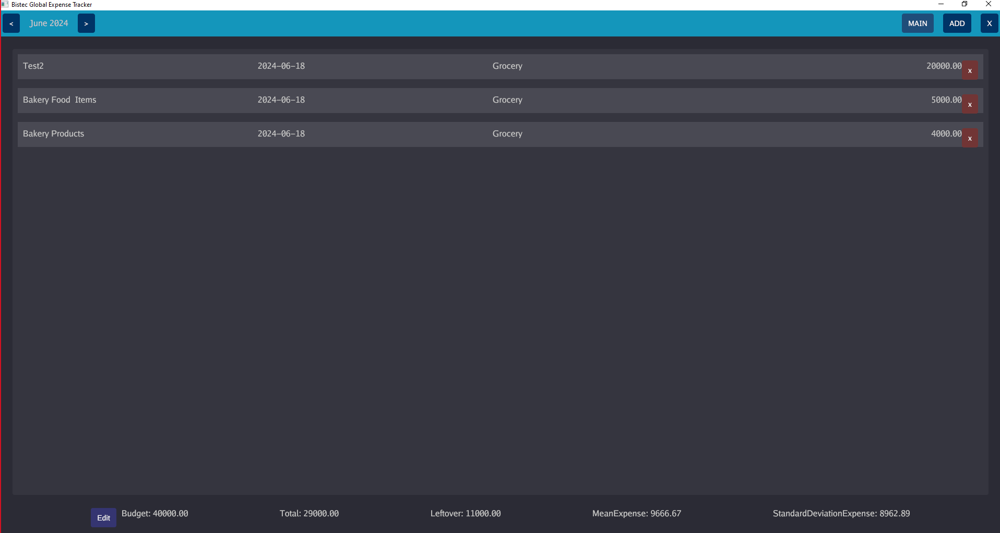

# Code-Crunch-June-Group-A
Expense tracker for Code Crunch - Interactive Project using Go Lang Features.
 
- Record Daily Expenses
- Update expenses
- categorize expences
- Give Statistical outputs using statistical libraries.
    -Mean Expense
    -Standard Deviation Expense
 
## Screenshot

